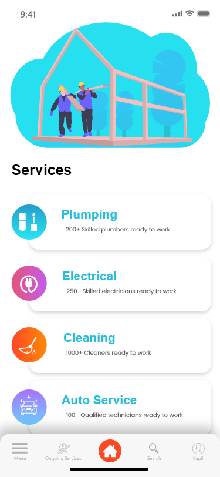
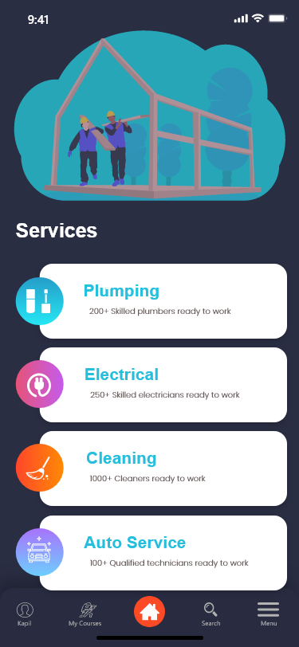

# Sample Services App UI
#### March 8th 2020
#### By **peteHack**



## Description

```bash

An sample User Interface design with a modern  and dark mode implementation.

```
## Technologies Used
[](https://forthebadge.com)


## Installation
* `https://gitlab.com/peter-wachira/sample-services-app-ui.git` this repository
* `cd sample-services-app-ui`

## Launching the Application

```bash
1.Launch the project in Android Studio

```


## Contact Details and Documentation

```bash

You can reach me via my personal email pwachira900@gmail.com

```


## License

- This project is licensed under the MIT Open Source license Copyright (c) 2019. [LICENCE](https://gitlab.com/peter-wachira/sample-services-app-ui/-/blob/developement/LICENSE)

[](https://forthebadge.com)

[](https://forthebadge.com)
